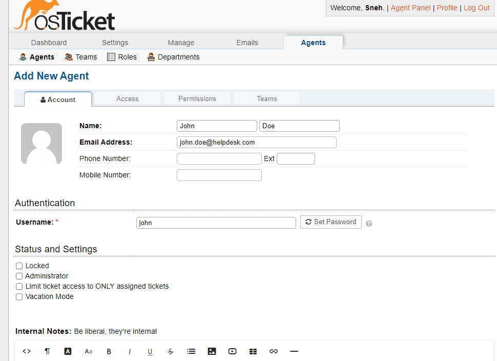
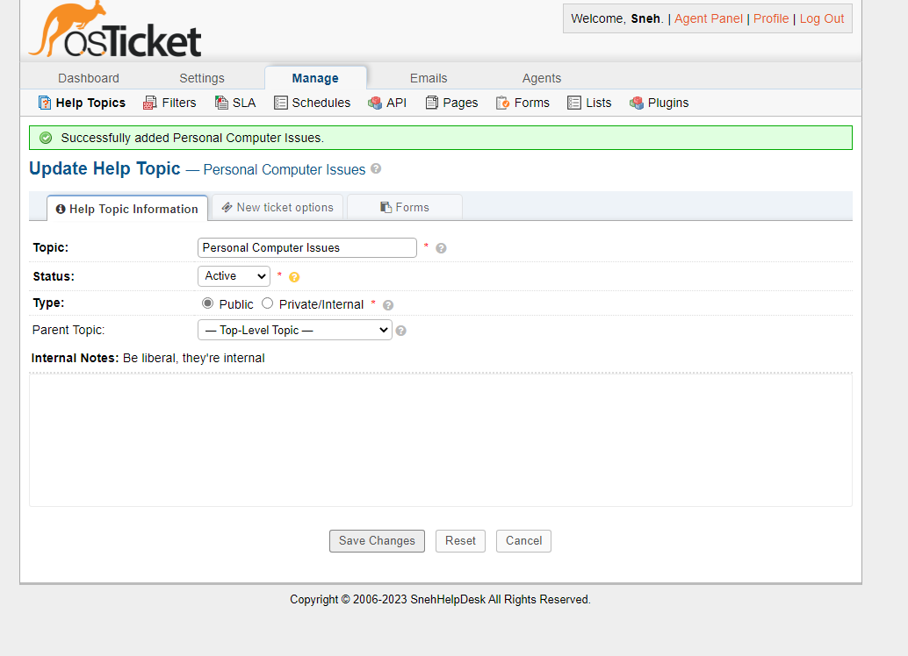

# osTicket - Post-Install Configuration

## This tutorial outlines the post-install configuration of the open-source help desk ticketing system osTicket.
### Environments and Technologies Used
- Microsoft Azure (Virtual Machines/Compute)

- Remote Desktop

- Internet Information Services (IIS)

## Operating Systems Used
 
-  Windows 10 (21H2)
 
### Post-Install Configuration Objectives
- Configure Roles
- Configure Departments
- Configure Teams
- Configure Agents
- Configure Users
- Configure SLA
- Configure Help Topics

### Configuration Steps

Configure Roles

Admin Panel -> Agents -> Roles.

Supreme Admin:

Configure Departments

Admin Panel -> Agents -> Departments.

System Administrators:

Configure Teams

Admin Panel -> Agents -> Teams.

Level II Support:

Allow anyone to create ticket

Admin Panel -> Settings -> User Settings.

Make sure "Require registration and login to create tickets" is not selected:

Configure Agents (workers)

Admin Panel -> Agents -> Add New.

Jane Doe:

John Doe:

Configure Users (customers)

Admin Panel -> Users -> Add New.

Karen User:

Repeat the same above for Karen User.

Configure SLA

Admin Panel -> Manage -> SLA.

Sev-A (1 hour, 24/7).

Sev-B (4 hours, 24/7).

Sev-C (8 hours, business hours):

Configure Help Topics

Admin Panel -> Manage -> Help Topics.

Business Critical Outage.

Personal Computer Issues.

Equipment Request.

Password Reset.

And now we are done configure osTicket. I hope this tutorial helped. All that's left is to practice triaging and solving tickets.

This is a very important skill to have for any help desk specialist, as they are the first line of communication between a company and it's customers when it comes to handling issues regarding a product or service they provide.
